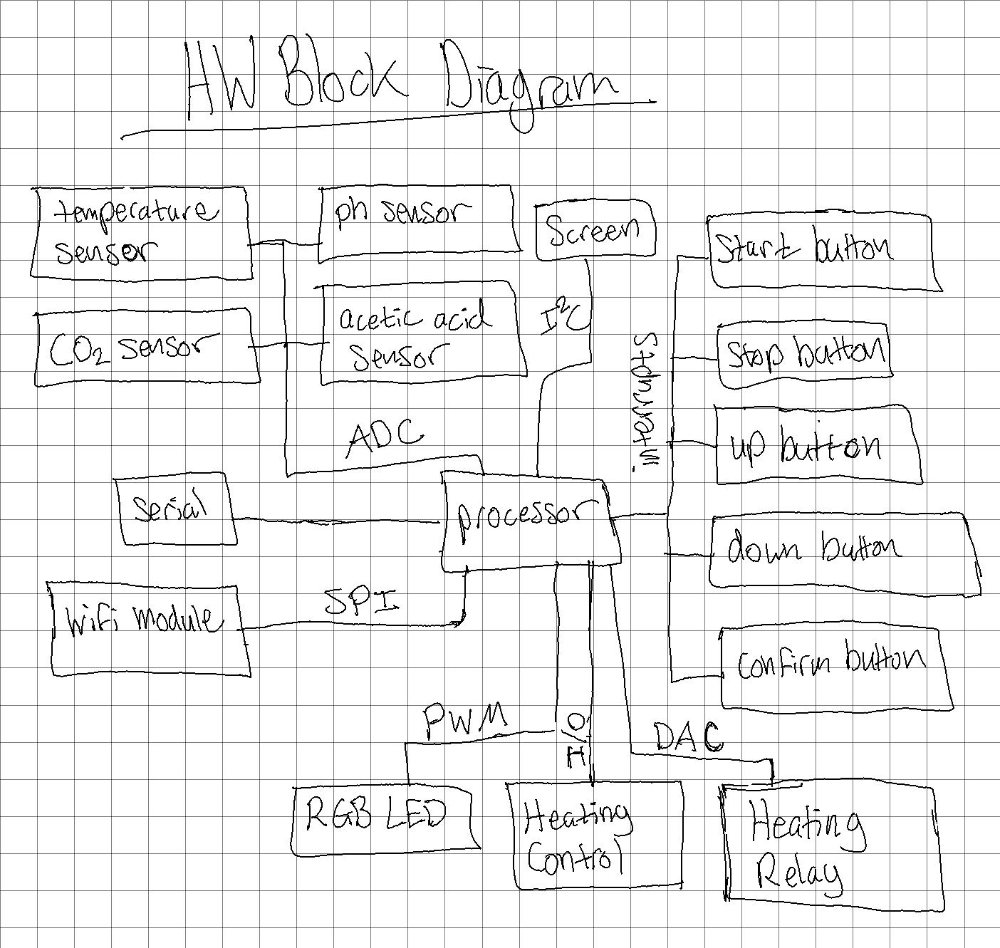
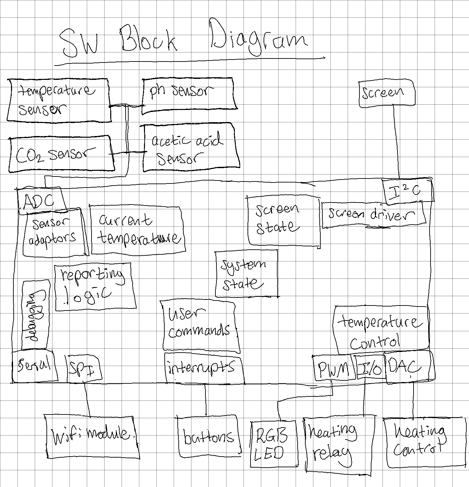
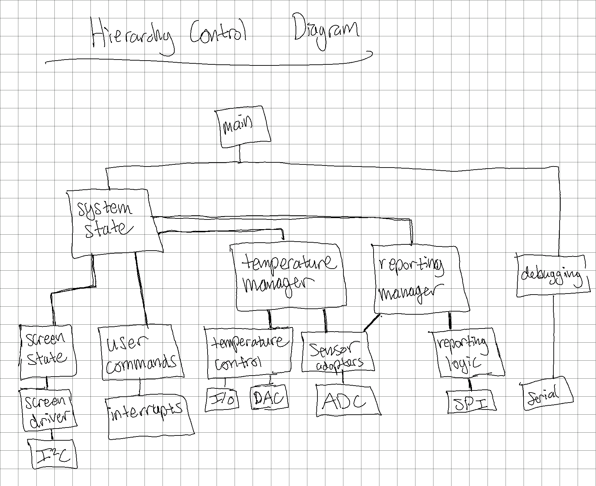

# Exercise 1: Idea Project Diagram

The project I'm describing is the Kombucha Chamber! This is not a real device nor do I want to make it. I don't even know if it would be useful, but I'm sure similar things do exist on an industrial scale.

The idea is to create a device that could continuously monitor ph, CO2, acetic acid, and temperature as kombucha brews and to maintain the kombucha at constant, user-defined temperature. Users have a simple control interface to start and stop recording and set temperature. The device has a small LCD screen for showing current readings, length of time the current session has been recording, and any critical error information. Because IoT is what all the cool kids do these days, all of the data is sent to a server over the Internet. And there's an RGB LED, because why not?

Please forgive the hand-drawn diagrams 😬. I drew them as neat as possible. Also, the hardware pieces are just my best guess based on my cursory knowledge of embedded systems. There's probably a lot missing or things that don't make sense. I would love feedback though!

## Hardware Block Diagram

## Software Block Diagram

## Hierarchy Control Diagram

## Things I'm Unsure About

- I'm not really sure how networking works in embedded systems. Based on some basic research, it *sounded like* there *might* be some external wifi modules that you communicate with via SPI. But then I know there's also SoCs out there that have everything built in 🤷‍♂
- The heating control was my best guess. I figured there would be a relay I could turn on and off with a GPIO pin. And to fine-tune the temperature, maybe I would need a DAC to control how hot it is when it's turned on?

## Future Possibilities

- One thing that I know is missing is some safety monitoring. There should be some kind of fail safe in case the heating element gets too hot. I'm not sure if that should happen in hardware, software, or both.
- There's two steps in the kombucha brewing process. The first step happens in an open container. The second step happens in an airtight container. In the airtight case, it would be interesting to monitor pressure, and there should be some safety features regarding pressure as well.
- Measuring brix could be interesting too, but including so many sensors in the diagram felt a bit excessive