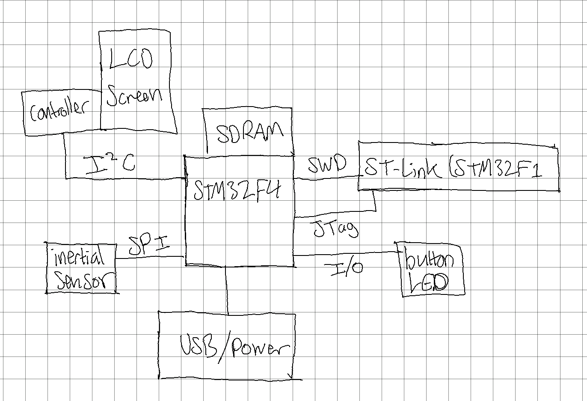
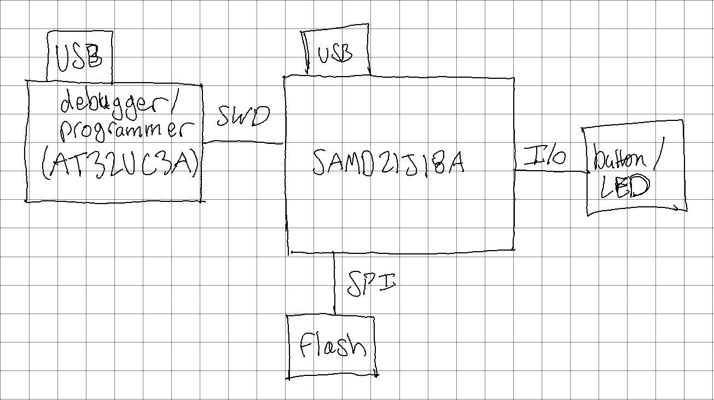

# Exercise 2: Investigate Project Boards

## STM32F429I-DISC1

### Hardware Block Diagram

### Specs

- Processor: STM32F429ZIT6
- Memory:
  - 2mb flash (on chip)
  - 256kb RAM (on chip)
  - 64mb SDRAM (external, on board)
- Peripherals:
  - I3G4250D, ST MEMS inertial sensor
  - RTC
  - Serial Audio Interface
  - 8 to 14 bit parallel camera interface, up to 54mbps
  - Chrom-ART Accelerator for hardware-accelerated graphics processing
  - USB 2.0 full-speed interface
- ADC:
  - 3 12-bit ADCs
  - up to 16 channels
  - between 2 and 6 maximum Msps, depending on configuration
- Cost:
  - Board:
    - [digikey](https://www.digikey.com/en/products/detail/stmicroelectronics/STM32F429I-DISC1/5731713): $29.90 per unit
    - [newark](https://www.newark.com/stmicroelectronics/stm32f429i-disc1/dev-board-advanced-line-mcu/dp/72Y1169): $41.66 per unit
    - [mouser](https://www.mouser.com/ProductDetail/STMicroelectronics/STM32F429I-DISC1?qs=79dOc3%2F91%2Fed3%252BRc5JUCEw%3D%3D): $29.90 per unit
  - Processor: between $7.1286 and $9.6117 per unit when purchasing 10k or more [source](https://www.st.com/en/microcontrollers-microprocessors/stm32f429zi.html#sample-buy)
- Availability:
  - I was able to find a little bit of stock through [this supplier](https://www.anglia-live.com/product/1055405001/STM32F429ZIT6/STMICROELECTRONICS/).
  - Some sellers on Alibaba seemed to have *some* stock, but the exact stock quantities were not very clear. [This site](https://www.hkinventory.com/p/d/STM32F429ZI.htm) seemed to indicate that there was some stock in China and Hong Kong, but I wasn't sure about the legitimacy of the information.
- App Notes: I read through quite a few app notes. Most of them were a bit over my head for the level of knowledge I have right now. I did read [this one](./an4365-using-stm32f4-mcu-power-modes-with-best-dynamic-efficiency-stmicroelectronics.pdf) a little more thoroughly because power efficiency is something I'm interested to learn about.

## SAMD21 Xplained PRO

### Hardware Block Diagram

### Specs

- Processor: SAMD21J18 (or ATSAMD21J18)
- Memory:
  - 256kb flash (on chip)
  - 32kb RAM (on chip)
  - 8Mbit serial flash (on board)
- Peripherals:
  - Peripheral Touch Controller: 256-Channel capacitive touch and proximity sensing
  - two-channel I2S interface
  - LIN client interface. (Based on some reading, LIN seems to be like a light-weight alternative to CAN for communications in automotive applications)
  - built-in Watchdog Timer
- ADC:
  - 1 12-bit ADC
  - up to 20 channels
  - 8, 10, or 12 bit resolution
  - up to 350ksps
- Cost:
  - Board:
    - [Microship Direct](https://www.microchip.com/en-us/development-tool/ATSAMD21-XPRO): $42.89 per unit
    - [digikey](https://www.digikey.com/en/products/detail/microchip-technology/ATSAMD21-XPRO/4842693?s=N4IgTCBcDaIM4EMC2ATMBGABADwA4BsEBLAOwFMVNcAnAexAF0BfIA): $43.74 per unit
    - [mouser](https://www.mouser.com/ProductDetail/Microchip-Technology-Atmel/ATSAMD21-XPRO?qs=KLFHFgXTQiBpMkTqxrpAWA%3D%3D): $43.75 per unit
  - Processor: between $3 and $4 when purchasing 5k or more units ([source](https://www.microchip.com/en-us/product/ATSAMD21J18#buy-from-store))
- Availability: Microchip doesn’t have any themselves [source](https://www.microchip.com/en-us/product/ATSAMD21J18#buy-from-store), and besides that, I couldn't find anywhere with any significant amounts of stock.
- App Notes: I had heard that SAMD21s were good for low power applications so I read through the following two app notes regarding power settings and low power techniques for the SAMD21
  - [Ultra Low Power Techniques](./Atmel-42411-Ultra-Low-Power-Techniques-AT06549_Application-Note.pdf)
  - [Peripheral Power Consumption in Standby Mode for SAM D Devices](./Atmel-42472-Peripheral-Power-Consumption-in-Standby-Mode-for-SAM-D-Devices_ApplicationNote_AT6490.pdf)